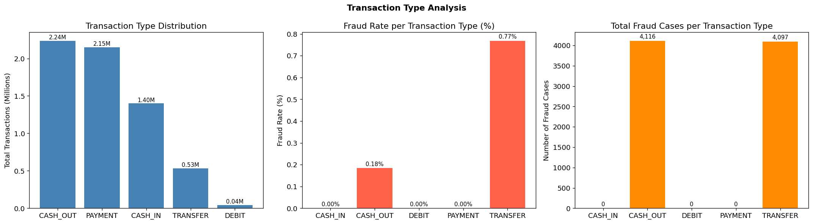
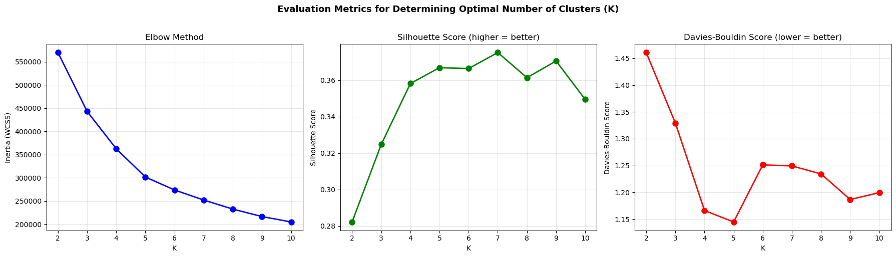
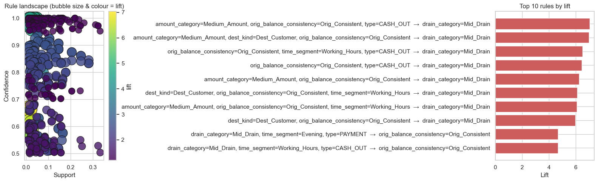
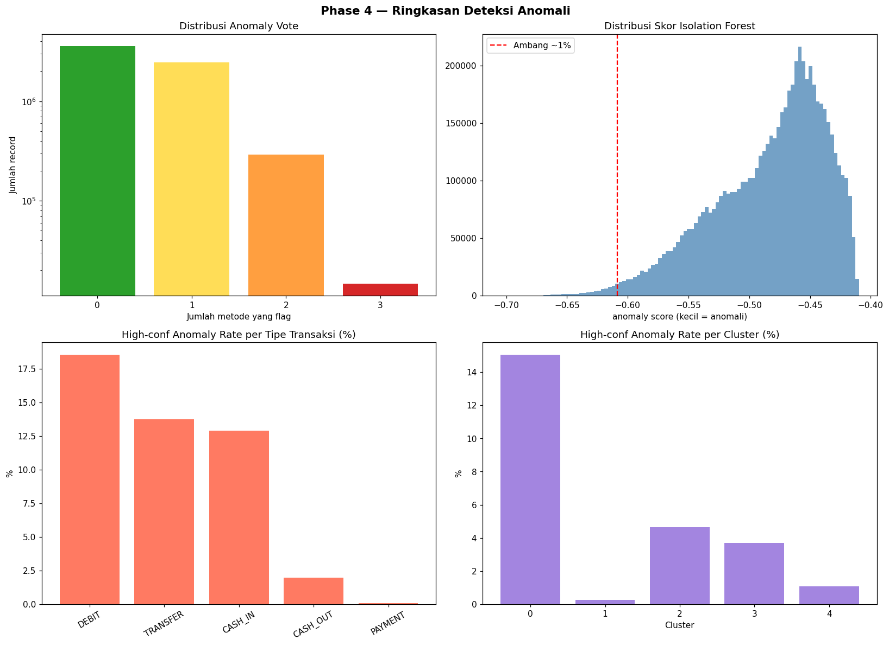

# 🏦 Data Mining — PaySim Synthetic Financial Fraud (KDD)

> Penerapan proses **Knowledge Discovery in Databases (KDD)** secara *end-to-end* atas dataset
> **PaySim** (6,3 juta transaksi keuangan) untuk menemukan **pola, segmen, dan anomali tersembunyi**.
> Fokusnya **penemuan & interpretasi pengetahuan** — bukan akurasi prediksi.

**Prinsip utama:** seluruh penambangan (*mining*) dilakukan **tanpa label**. Kolom `isFraud` hanya
dibuka di akhir untuk **validasi**, tidak pernah menjadi target saat mining.

---

## 🔗 Coba Dashboard Live

Seluruh temuan proyek ini dapat dijelajahi **langsung di browser — tanpa instalasi apa pun**:

<p align="center">
  <a href="https://data-mining-paysim-synthetic-financial-fraud-production.up.railway.app/">
    
  </a>
</p>

> **▶️ [https://data-mining-paysim-synthetic-financial-fraud-production.up.railway.app/](https://data-mining-paysim-synthetic-financial-fraud-production.up.railway.app/)**
>
> Jelajahi peta segmen, aturan **JIKA → MAKA**, deteksi anomali *klik-untuk-jelaskan*, dan simulator
> **"fokus pengawasan"** — tersedia **dwibahasa (ID/EN)**. *(Server gratis; muat pertama bisa butuh beberapa detik untuk "bangun".)*

## ❓ Pertanyaan Sentral

> **"Apa pengetahuan yang kami temukan, yang TIDAK terlihat dari data mentah?"**

Dari data mentah kita hanya melihat *jenis, nominal, dan waktu*. Proyek ini menemukan bahwa **penipuan
bukan soal nominal besar, melainkan pola perilaku** — dan pola itu bisa disaring hingga **cukup memeriksa
10% transaksi untuk menangkap ~76% penipuan, tanpa satu pun label.**

## 📊 Temuan Utama (angka nyata)

| Metrik | Nilai | Makna |
|---|---|---|
| Total transaksi | **6.362.620** | dataset PaySim, ± 30 hari |
| Prevalensi penipuan | **0,129%** | 8.213 kasus (1 dari ~775) |
| Segmen perilaku | **5** | hasil clustering K-Means |
| Transaksi janggal (high-conf) | **5,01%** | ± 318.857 tx disaring, tanpa label |
| Ketajaman deteksi (ROC-AUC) | **0,94** | 10% paling janggal memuat **76,4%** penipuan |
| Lonjakan saat 3 metode sepakat | **± 69×** | fraud rate 0,05% → 8,9% |

**Insight kunci:** *anomali ≠ penipuan* (DEBIT sering janggal tapi 0 fraud), dan segmen **paling berisiko
justru yang paling terlihat normal** — hanya bisa ditemukan lewat clustering + deteksi anomali, bukan aturan sederhana.

---

## 🔬 Metodologi KDD — 5 Fase

### Fase 1 — Data Understanding & Preprocessing
- **EDA menyeluruh** (kualitas data, distribusi tipe, zero-balance, korelasi, entropy, pola per jam).
- **Rekayasa fitur perilaku:** `errorBalanceOrig/Dest`, `balance_drain_ratio`, `emptied_origin`, `time_segment`, `amount_category`, dll.
- **Transformasi:** `log1p` → `StandardScaler` → clip `[-5,5]`; diskretisasi `qcut` 3 tertil seimbang.
- **Justifikasi:** StandardScaler menggantikan RobustScaler karena `errorBalanceDest` ~65% bernilai 0 → IQR≈0 → varians meledak (338.966; PC1 99,82%). Setelah perbaikan: varians ≈1, PC1 turun ke ~34%.

<p align="center">
  <br>
  <em>Distribusi jenis transaksi + fraud per tipe — penipuan hanya di TRANSFER & CASH_OUT.</em>
</p>

### Fase 2 — Segmentation via Clustering
- **K-Means** (seluruh 6,3 jt), divalidasi **DBSCAN** (densitas) & **Hierarchical** (koneksi).
- **K optimal = 5** lewat **Elbow + Silhouette + Davies-Bouldin** (DB minimum di K=5 = 1,145).
- **Profiling** tiap cluster + nama bisnis + ekspor label & jarak-ke-centroid untuk Fase 4.

<p align="center">
  <br>
  <em>Penentuan K: Elbow, Silhouette, dan Davies-Bouldin sepakat di K=5.</em>
</p>

### Fase 3 — Association Rule Mining
- **Apriori** atas 7 atribut kategorikal (`min_support=0.01`, `max_len=4`) → **12 aturan** "JIKA → MAKA".
- **Anti-tautologi** dengan **Cramér's V** (buang `type↔dest_kind` yang redundan sempurna, V=1,00).
- Ranking pakai **Lift** (bukan Confidence). Temuan: *transfer yang mengosongkan rekening di jam kerja hampir pasti bernominal besar* (lift 2,7×) — pola terdekat dengan fraud.

<p align="center">
  <br>
  <em>Ruang aturan (Support × Confidence, warna = Lift) + 10 aturan lift tertinggi.</em>
</p>

### Fase 4 — Anomaly & Outlier Detection
- **3 metode:** IQR (43%), Z-score (4,4%), **Isolation Forest** (1%) + **ensemble voting**.
- **Cross-reference** dengan cluster outlier Fase 2; validasi post-hoc dengan `isFraud`.
- Fraud rate naik **monoton** seiring kesepakatan: 0,05% → **8,9%** (± 69×) saat 3 metode setuju.
- **Interpretasi bisnis:** tiap anomali diklasifikasi *data error / rare-but-legitimate / risk signal*.

<p align="center">
  <br>
  <em>Ringkasan anomali: distribusi vote, skor Isolation Forest, anomaly rate per tipe & cluster.</em>
</p>

### Fase 5 — Knowledge Presentation (Dashboard)
Dashboard **interaktif Python Dash** yang menerjemahkan seluruh temuan ke **bahasa bisnis non-teknis**,
dwibahasa **ID/EN**, dengan latency interaksi **< 100 ms** (pra-agregasi per hari + WebGL).

**6 menu:** Ringkasan · Segmentasi · Pola Normal (JIKA→MAKA) · Deteksi Anomali (klik-untuk-jelaskan) ·
Insight Bisnis (simulator "fokus pengawasan") · Dokumentasi (laporan teknis + plot tiap fase).

---

## 🚀 Menjalankan Proyek

### 1. Dashboard (Fase 5)
```bash
cd notebooks/Phase5/dashboard
pip install -r requirements.txt
python app.py        # buka http://localhost:8050
```
> Data agregat sudah tersedia di `notebooks/Phase5/data/` (hasil `phase5_prepare_data.ipynb`).
> Untuk regenerasi: jalankan seluruh sel notebook itu (butuh env dengan `pandas, scikit-learn, scipy, pyarrow`).

### 2. Notebook tiap fase
Notebook analisis ada di `notebooks/Phase1` … `notebooks/Phase4`; penyiapan data dashboard di `notebooks/Phase5`.

---

## 🗂️ Struktur Repository

```
├── data/processed/real_used/      # hasil hand-off Phase 1-4 (parquet; tidak di-commit karena besar)
├── notebooks/
│   ├── Phase1/   # Data Understanding & Preprocessing (EDA, cleaning, feature engineering)
│   ├── Phase2/   # Clustering (K-Means, DBSCAN, Hierarchical)
│   ├── Phase3/   # Association Rule Mining (Apriori)
│   ├── Phase4/   # Anomaly & Outlier Detection (IQR, Z-score, Isolation Forest)
│   └── Phase5/
│       ├── phase5_prepare_data.ipynb   # sampling + agregasi per-hari + uji representativeness
│       ├── data/                        # berkas agregat kecil (~0,6 MB) yang dibaca dashboard
│       └── dashboard/                   # aplikasi Dash (app.py, assets, requirements)
├── outputs/phase4/                # laporan & ringkasan anomali
└── Dockerfile                     # deploy dashboard (Railway / container)
```

---

## 🧰 Tech Stack
**Python** · pandas · NumPy · scikit-learn · SciPy · mlxtend (Apriori) · **Plotly Dash** · Jupyter · Docker

---

## ⚖️ Keterbatasan (kejujuran metodologis)
- **PaySim sintetis:** yang kami klaim adalah **metodologi yang menemukan struktur tanpa label**, bukan bahwa pola ini persis menggambarkan fraud dunia nyata. Angka spesifik wajib divalidasi ulang pada data nyata.
- **Metode tanpa label punya titik buta:** fraud yang menyamar sempurna (segmen "normal") tak tertangkap tanpa label, di produksi perlu dipadukan dengan pembelajaran *supervised*.
- **Sampling anomali (1,2 jt):** dibuktikan representatif via uji Kolmogorov–Smirnov (≈ 0,0009) + kesamaan fraud rate sampel vs populasi (0,131% vs 0,129%).

---

## 👥 Tim
Group 7 *Data Mining Course Project*:
1. Data Engineer (I Gusti Bagus Arya Siwandana Janatha & Alfredo Putu Setyanugraha Atmaja)
2. Segmentation Specialist (Fino Wildan Ramadan)
3. Pattern Analyst (Edwin Hendly)
4. Insight Communicator (Ardika Hidayatur Rohman)

---

<p align="center"><em>Ukuran sukses proyek ini: temuan yang <strong>actionable & non-trivial</strong> — bukan akurasi model.</em></p>
